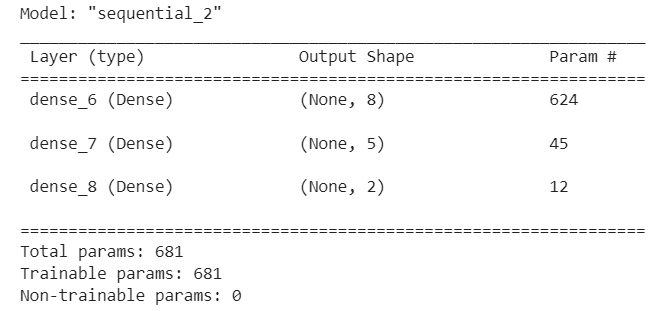

### Report on the Neural Network Model

Here I will outline the generation and performance of the deep learning model created for Alphabet Soup (data from provided file charity.csv)

# Overview of the analysis: 

Explain the purpose of this analysis.

## Results: 

# Data Preprocessing
    Model target: I set the variable IS_SUCCESSFUL as my target, as I felt whether or not the money was used effectively to be the most important variable to select applicants as the nonprofit Alphabet Soup has requested a tool that "can help select the applicants for funding with the best chance of success in their ventures." 

    Model features: All remaining variables were included as features with the exception of those below.

    Removed variables: Columns EIN and NAME were removed as they are identification columns that lack relevancy to this purpose.

    All categorical values were encoded, and all data was scaled. Two categorical columns, CLASSIFICATION and APPLICATION_TYPE were binned, using the cutoff frequency parameter of 5% of the total number of rows in the database. Therefore, anything under that was binned.

# Compiling, Training, and Evaluating the Model
  The model was defined as a deep neural net, with two hidden laters and one output layer. The hidden layers utilized relu activation functions, while the output layer utilized softmax to normalize the output of the net.

  

  It was fit and trained with 100 epochs.

  The model was evaluated through testing on a validation dataset and achieved the following results:

    -On 268 batches of data the average loss was 0.6625 and accuracy was 1.0000. Therefore, the model is demonstrating an accuracy of 100%, with a relatively low loss indicating good performance.

  Model improvement: I initially had removed additional categorical columns from the features to evaluate the loss and accuracy of the model without them and found that accuracy was greatly affected, not reaching above 0.5, so I encoded all features and included them and reran the training and evaluation to achieve the results above.

# Summary: 

According to the evaluation above, the model was fairly successful. Further testing would be required before determining if this model is ready to be applied to new data for application decisions. 

As the question of whether or not an applicant will be successful has binary output (Yes or No), it would be possible to apply a logistic regression model. Then, evaluation with a confusion matrix and classification report would provide additional information on the prediction ability of the model. If this proves too simplistic for this data, it would be possible to modify the model above by adjusting the number of hidden layers, as well as the activation functions within them (could include linear or sigmoid), or even the number of training epochs, though it should then be monitoring for overfitting as a result. 
